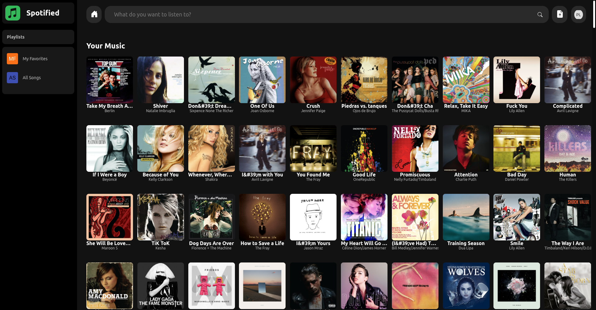

# Spotified

A web-based music streaming service built with Flask, allowing users to upload, organize, and stream their music collection.



## Features

- **User Authentication**: Secure user registration and login system
- **Music Upload**: Upload audio files (MP3, FLAC, M4A, WAV, OGG, AAC) up to 100MB each
- **Playlist Management**: Create, edit, and delete playlists
- **Music Player**: Stream music with a built-in web player
- **Metadata Extraction**: Automatic extraction of song metadata (title, artist, album, etc.)
- **Cover Art**: Automatic cover art fetching and display
- **Responsive Design**: Mobile-friendly interface
- **Security**: CSRF protection, secure headers, input validation

## Technologies Used

- **Backend**: Flask (Python web framework)
- **Database**: SQLite
- **Authentication**: JWT tokens with session management
- **Audio Processing**: TinyTag for metadata extraction
- **Security**: Flask-Talisman for security headers
- **Frontend**: HTML, CSS, JavaScript
- **CORS**: Flask-CORS for cross-origin requests

## Installation

1. **Clone the repository**:
   ```bash
   git clone <repository-url>
   cd Spotified
   ```

2. **Install dependencies**:
   ```bash
   pip install -r requirements.txt
   ```

3. **Set environment variables** (optional):
   - `SECRET_KEY`: For session security (defaults to a development key)
   - `ALLOWED_ORIGINS`: Comma-separated list of allowed origins for CORS (defaults to `http://localhost:8080`)

4. **Run the application**:
   ```bash
   python app.py
   ```

5. **Access the app**:
   Open your browser and go to `http://localhost:8080`

## Usage

1. **Register**: Create a new account with email and password
2. **Login**: Sign in to your account
3. **Upload Music**: Use the upload feature to add songs to your library
4. **Create Playlists**: Organize your music into playlists
5. **Play Music**: Stream your music directly in the browser
6. **Manage Library**: View and manage your uploaded songs and playlists

## Project Structure

```
Spotified/
├── app.py                 # Main Flask application
├── auth.py                # Authentication utilities
├── database.py            # Database operations
├── metadata_extractor.py  # Audio metadata extraction
├── requirements.txt       # Python dependencies
├── static/                # Static files (CSS, images)
│   └── css/
├── templates/             # HTML templates
│   ├── index.html
│   ├── login.html
│   ├── signup.html
│   ├── music.html
│   ├── playlists.html
│   ├── profile.html
│   └── search.html
└── uploads/               # Uploaded files (created automatically)
```

## API Endpoints

The application provides RESTful API endpoints for music operations:

- `POST /api/login` - User login
- `POST /api/signup` - User registration
- `POST /api/upload` - Upload music files
- `GET /api/songs` - Get user's songs
- `POST /api/playlists` - Create playlist
- `GET /api/playlists` - Get user's playlists
- And more...

## Security Features

- Password hashing with secure algorithms
- JWT token-based authentication
- CSRF protection
- Input sanitization and validation
- Secure file upload handling
- HTTPS enforcement in production
- Content Security Policy (CSP) headers

## Contributing

1. Fork the repository
2. Create a feature branch
3. Make your changes
4. Test thoroughly
5. Submit a pull request

## License

This project is licensed under the MIT License - see the LICENSE file for details.

## Disclaimer

This is a personal project for educational purposes. Ensure you have the rights to upload and stream any music files.